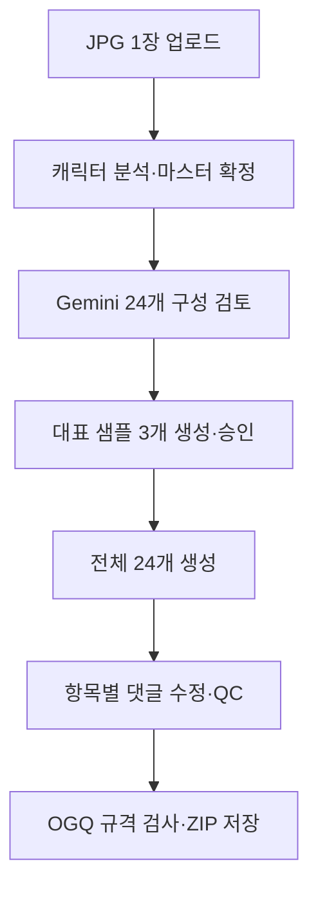
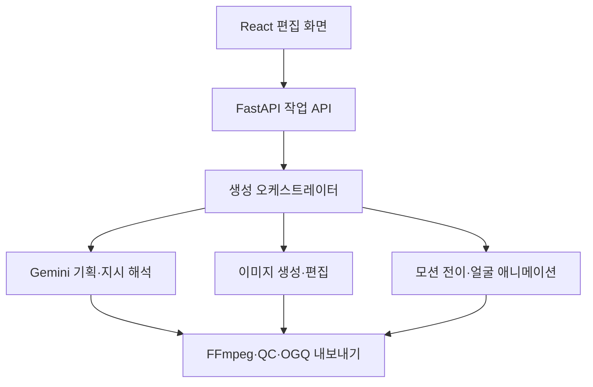

# 사진 한 장 기반 고품질 움직이는 이모티콘 제작기 PRD

> 문서 상태: **현재 기준 PRD**  
> 구현 변경 사항은 [날짜별 변경 이력](../CHANGELOG.md)을 참고한다.

> 무료 우선 1인 MVP · OGQ 24개 세트 제작 파일럿  
> 문서 버전: v1.0  
> 기준일: 2026-08-25  
> 제품 가칭: **MotiCon Studio**

---

## 0. 문서 목적과 확정된 결정

이 문서는 사용자가 업로드한 JPG 사진을 마스터 캐릭터로 변환하고, 캐릭터의 정체성을 유지한 채 표정·몸짓·문구·동작이 서로 다른 움직이는 이모티콘 24개를 제작하는 웹앱의 상세 제품 요구사항이다.

현재 단계는 다중 사용자용 상용 서비스가 아니라 **제작자 본인 한 명이 실제 24개 세트를 만들고 OGQ 심사 결과까지 확인하는 검증용 MVP**다. 로그인, 결제, 팀 기능보다 결과물 품질, 수정 편의성, 실패 복구, OGQ 규격 검사를 우선한다.

다음 사항은 확정 요구사항이다.

| 구분 | 확정 내용 |
| --- | --- |
| 최초 입력 | 사용자가 JPG 사진 1장을 업로드한다. |
| 추가 입력 | 정체성 보강용 사진을 선택적으로 추가 등록할 수 있다. |
| 마스터 생성 | 업로드 사진으로 일관된 마스터 캐릭터를 만든다. |
| 24개 기획 | Gemini가 캐릭터 콘셉트에 맞춰 문구·표정·포즈·동작 24개를 자동 구성한다. |
| 품질 확인 | 마스터 캐릭터와 대표 샘플 3개를 먼저 승인한 뒤 나머지 21개를 생성한다. |
| 동작 방식 | 기본 동작 선택과 사용자 동작 영상 업로드를 모두 지원한다. |
| 필수 표현 | 웃기, 작아지기, 커지기뿐 아니라 멀리서 달려오기, 인사하기, 좋아서 방방 뛰기 등 표정과 전신 몸짓이 결합된 동작을 지원한다. |
| 개별 수정 | 24개 중 원하는 항목만 선택해 댓글/채팅처럼 자연어로 수정 요청한다. |
| 비용 전략 | 무료 AI·무료 할당량을 먼저 사용하고, 부족한 작업만 예상 비용을 확인한 뒤 Google 유료 모델로 전환한다. |
| 최종 산출물 | 움직이는 이모티콘 24개, 대표 이미지, 탭 이미지, 제작 메타데이터, OGQ 제출용 ZIP을 생성한다. |

---

## 1. 정책상 중요한 전제

### 1.1 OGQ 승인 보장 금지

OGQ의 현재 공식 반려 사유에는 생성형 AI로 제작된 스티커가 포함되어 있다. 이 제품은 생성형 AI로 원본 사진을 캐릭터화하므로 **OGQ 규격에 맞는 파일을 만들 수는 있어도 OGQ 심사 통과를 보장하거나 ‘OGQ 승인 가능’으로 표시해서는 안 된다.**

따라서 MVP의 첫 출시는 다음과 같이 정의한다.

- 제품 목표: 고품질 24개 세트 제작과 OGQ 파일 규격 자동 검사
- 검증 목표: 실제 OGQ 제출 후 심사 결과와 반려 사유 수집
- 금지 표현: `OGQ 승인 보장`, `OGQ 공식 인증`, `심사 100% 통과`
- 허용 표현: `OGQ 제출 규격 검사 완료`, `제출용 파일 생성 완료`, `최종 심사는 플랫폼 정책에 따름`
- 반려 시 행동: 반려 사유를 프로젝트에 기록하고, 수동 수정 또는 다른 판매 채널용 내보내기를 검토한다.

### 1.2 저작권·초상권 전제

사용자는 본인이 권리를 가진 사진과 동작 영상만 업로드해야 한다. 타인의 얼굴, 유명 캐릭터, 브랜드 로고, 저작권이 있는 그림이나 영상의 무단 사용을 허용하지 않는다. 프로젝트 생성 시 다음 확인을 받는다.

1. 사진 속 인물 또는 캐릭터를 사용할 권리가 있다.
2. 업로드한 동작 영상의 사용 권리가 있다.
3. 생성 결과의 플랫폼 심사 및 상업적 사용 가능성은 별도 정책에 좌우될 수 있음을 이해한다.

---

## 2. 제품 개요

### 2.1 문제

사진 한 장을 흔들거나 확대·축소하는 수준의 애니메이션은 실제 판매용 이모티콘처럼 보이지 않는다. 판매 가능한 품질을 내려면 다음 작업이 함께 필요하다.

- 사진 속 대상과 배경을 정확히 분리하고 캐릭터 스타일로 재구성
- 24개 모두에서 얼굴, 헤어, 의상, 색, 체형을 일관되게 유지
- 문구의 의도에 맞는 표정과 전신 포즈 생성
- 달려오기, 손 흔들기, 점프 등 시간 흐름이 있는 동작 설계
- 손·팔·다리·얼굴의 깨짐과 프레임 흔들림 보정
- 반복 재생이 자연스러운 루프와 투명 배경 GIF 제작
- 실패한 한 항목만 지시문으로 다시 수정하는 편집 흐름
- 플랫폼 규격 검사와 24개 묶음 내보내기

### 2.2 제품 제안

MotiCon Studio는 AI 한 종류에 모든 작업을 맡기지 않는다. Gemini는 캐릭터 분석과 24개 구성, 프롬프트 작성, 수정 의도 해석을 담당하고, 이미지 생성·편집 모델은 마스터 캐릭터와 키프레임을 만들며, 모션 전이 모델은 동작 영상 또는 기본 동작을 캐릭터에 적용한다. 마지막으로 일반 영상 처리 도구가 배경·프레임·루프·GIF·용량을 정리한다.

### 2.3 핵심 가치

- **한 장에서 시작:** JPG 1장만 있어도 제작을 시작한다.
- **정체성 우선:** 24개를 만들기 전에 마스터 캐릭터를 확정하고 잠근다.
- **움직임의 의미:** 단순 효과가 아닌 표정과 전신 연기가 연결된 동작을 만든다.
- **샘플 승인:** 비용과 시간을 쓰기 전에 대표 3개로 품질을 확인한다.
- **항목별 대화 수정:** 마음에 들지 않는 결과만 댓글처럼 지시해 바꾼다.
- **무료 우선:** 무료 할당량과 로컬 처리를 우선하되 결과 품질이 부족할 때만 유료 모델을 제안한다.

---

## 3. 목표와 비목표

### 3.1 MVP 목표

1. JPG 1장과 선택적 추가 사진으로 재사용 가능한 마스터 캐릭터를 만든다.
2. Gemini가 캐릭터 콘셉트와 중복되지 않는 의사 표현 24개를 자동 기획한다.
3. 대표 샘플 3개 승인 후 전체 24개를 중단·재개 가능한 작업으로 생성한다.
4. 기본 동작과 사용자 업로드 동작 영상을 모두 지원한다.
5. 각 항목의 문구·표정·포즈·동작·속도를 독립적으로 수정한다.
6. 자동 품질 검사와 사람이 확인할 체크리스트를 함께 제공한다.
7. OGQ 애니메이션 스티커 파일 규격을 검사하고 ZIP으로 내보낸다.
8. 무료·유료 모델 사용량과 항목별 비용을 기록한다.

### 3.2 MVP 비목표

- 여러 사용자의 회원가입, 구독, 결제, 권한 관리
- 웹에서 OGQ로 자동 제출
- 모든 컴퓨터에서 무조건 로컬 AI 실행
- 사용자가 제공하지 않은 유명 캐릭터의 복제
- 심사 통과 또는 판매 수익 보장
- 전문 애니메이션 편집기의 프레임 단위 모든 기능 대체
- 음성, 배경음악, 긴 동영상 제작

---

## 4. 대상 사용자와 대표 시나리오

### 4.1 1차 사용자

- 자신의 사진이나 직접 만든 캐릭터를 이모티콘으로 만들려는 1인 크리에이터
- AI·영상 편집 전문 지식은 많지 않지만 결과를 직접 비교하고 선택할 수 있는 사용자
- 무료로 먼저 검증하고, 품질이 확인된 일부 작업에는 비용을 지불할 의향이 있는 사용자

### 4.2 대표 시나리오

사용자는 정면에 가깝고 전신 또는 상반신이 선명한 JPG를 올린다. Gemini가 인상, 의상, 대표 색, 어울리는 말투를 분석한다. 시스템이 캐릭터 시안 4개를 만들면 사용자가 하나를 고르고 필요한 부분을 수정한 뒤 마스터로 확정한다. Gemini는 이 캐릭터에 맞는 24개 이모티콘 기획표를 제안하고, 사용자는 문구나 동작을 바꾼다. 시스템은 달려오기, 인사하기, 방방 뛰기 3개를 먼저 생성한다. 사용자가 품질을 승인하면 나머지 21개를 만들고, 실패한 항목은 카드의 댓글 창에서 `표정은 더 신나게, 옷과 머리는 그대로`처럼 요청해 그 항목만 재생성한다. 마지막으로 규격 검사를 통과한 파일을 ZIP으로 저장한다.

---

## 5. 전체 사용자 흐름



### 5.1 승인 게이트

대량 생성 전에 반드시 두 번의 명시적 승인을 받는다.

- 게이트 A — 마스터 확정: 얼굴, 헤어, 의상, 체형, 색상, 그림체 승인
- 게이트 B — 샘플 3개 확정: 정체성, 표정, 전신 동작, 문구, GIF 품질 승인

마스터가 바뀌면 기존 샘플은 `이전 마스터 결과`로 표시하며 자동 덮어쓰지 않는다. 새 마스터로 전체를 다시 만들 때 예상 작업량과 유료 비용 가능성을 표시한다.

---

## 6. 화면 구성

| 화면 | 목적 | 핵심 UI |
| --- | --- | --- |
| 1. 프로젝트 시작 | 새 제작 시작·이전 작업 재개 | 새 프로젝트, 최근 프로젝트, 저장 위치 |
| 2. 사진 업로드 | 최초 사진과 선택 참조 수집 | JPG 드롭존, 추가 사진, 품질 안내, 권리 확인 |
| 3. 캐릭터 분석 | 사진 상태와 콘셉트 확인 | 자동 크롭, 배경 분리, 분석 태그, 수정 가능한 콘셉트 |
| 4. 마스터 선택 | 캐릭터 시안 선택·확정 | 4개 시안, 비교, 부분 수정, 마스터 잠금 |
| 5. 24개 구성표 | 전체 세트 기획 검토 | 24개 카드, 문구·감정·동작·속도, 교체·재추천 |
| 6. 샘플 3개 | 고난도 대표 동작 확인 | 원본/결과 비교, 동시 재생, 댓글 수정, 승인 |
| 7. 전체 생성 | 21개 추가 생성 | 작업 큐, 진행률, 무료 할당량, 일시정지·재개 |
| 8. 세트 편집실 | 24개 검토·개별 수정 | 카드 그리드, 선택 재생, 댓글 패널, 버전 비교 |
| 9. QC 및 내보내기 | 오류 수정·ZIP 생성 | 자동 검사, 수동 체크, 대표/탭 이미지, ZIP |
| 10. 설정 | 모델·키·저장·비용 설정 | 무료 우선, 유료 승인 규칙, API 키 상태, 삭제 |

---

## 7. 상세 기능 요구사항

### FR-01. 프로젝트 생성과 자동 저장

- 사용자는 프로젝트 이름을 입력하거나 자동 생성 이름을 사용한다.
- 프로젝트는 로컬 DB와 프로젝트 폴더에 자동 저장한다.
- 브라우저를 닫거나 백엔드를 재시작해도 마지막 완료 단계부터 이어서 작업한다.
- 원본, 마스터, 생성 결과, 수정 버전, 내보내기 파일을 서로 다른 하위 폴더에 보존한다.
- 삭제는 프로젝트 단위로 수행하며 원본과 파생 파일 범위를 미리 표시한다.

### FR-02. JPG 업로드와 입력 품질 검사

#### 필수

- MVP의 기본 입력은 JPG/JPEG 1장이다.
- 최대 파일 크기와 최소 해상도는 환경 설정으로 관리한다. 기본 권장값은 긴 변 1,500px 이상이다.
- 업로드 즉시 얼굴/대상 탐지, 초점, 노출, 가림, 잘림, 배경 복잡도를 검사한다.
- EXIF 위치 정보를 제거한 작업용 사본을 만든다.
- 원본은 생성 전 미리보기와 사용자 확인 없이 외부 모델에 전송하지 않는다.

#### 선택적 추가 사진

- 사용자는 정면, 좌우 측면, 전신, 표정 사진을 추가 등록할 수 있다.
- 추가 사진은 필수가 아니며 `정체성 보강` 목적임을 안내한다.
- 각 추가 사진에 `정면`, `측면`, `전신`, `의상`, `표정 참고` 태그를 지정한다.
- 서로 다른 인물로 의심되는 사진은 경고하고 사용자가 제외할 수 있게 한다.
- 추가 사진이 기존 마스터와 충돌하면 자동 반영하지 않고 재학습/재생성 범위를 확인한다.

### FR-03. 캐릭터 콘셉트 분석

Gemini 비전·텍스트 기능은 입력 사진과 사용자의 짧은 설명을 바탕으로 다음 구조화 데이터를 제안한다.

- 대상 유형: 사람, 반려동물, 사용자가 그린 캐릭터
- 핵심 특징: 얼굴형, 헤어, 안경, 점, 귀, 꼬리, 의상 등
- 대표 색 3~5개
- 캐릭터 성격 키워드 3개
- 어울리는 말투: 귀여움, 유쾌함, 담백함 등
- 피해야 할 변화: 헤어색 변경 금지, 안경 유지 등
- 추천 그림체와 선 굵기

분석 결과는 모두 사용자가 편집할 수 있어야 하며, 확정 값은 `Character Identity Manifest`로 저장한다.

### FR-04. 마스터 캐릭터 생성과 잠금

- 시스템은 동일한 콘셉트로 마스터 시안 4개를 제안한다.
- 사용자는 한 시안을 선택하고 댓글 방식으로 수정할 수 있다.
- 기본 마스터 시트에는 정면 전신, 3/4 전신, 얼굴 확대, 기본 표정, 대표 색상표를 포함한다.
- 마스터 확정 전에는 시안 재생성이 가능하다.
- 마스터 확정 후 `정체성 잠금` 상태로 전환한다.
- 이후 생성 프롬프트에는 매번 동일한 마스터 이미지와 Identity Manifest를 참조한다.
- 기본적으로 머리, 얼굴 특징, 의상, 체형, 그림체는 잠그고 표정·포즈·동작만 바꾼다.
- 사용자가 잠긴 특징을 바꾸려 하면 `이 변경은 24개 전체 일관성에 영향을 줄 수 있음`을 알린다.

### FR-05. Gemini의 24개 자동 구성

Gemini는 마스터 콘셉트와 사용자의 목적을 입력으로 받아 정확히 24개의 `StickerPlanItem`을 JSON으로 생성한다. 각 항목에는 다음 값이 있어야 한다.

| 필드 | 설명 |
| --- | --- |
| slot_no | 1~24 고유 번호 |
| phrase | 최종 표시 문구 |
| intent | 대화에서의 사용 목적 |
| emotion | 주요 감정 |
| facial_expression | 눈·입·눈썹 등 표정 설명 |
| body_pose | 시작·중간·끝 전신 포즈 |
| motion_source | 기본 동작 또는 업로드 영상 |
| motion_prompt | 시간 순서가 있는 동작 설명 |
| camera | 고정, 줌, 원근 이동 등 |
| duration | 권장 재생 시간 |
| speed | 느림, 보통, 빠름 |
| loop_strategy | 왕복, 첫 프레임 복귀, 컷 전환 등 |
| text_style | 글꼴 분위기, 배치, 강조어 |
| difficulty | 낮음, 중간, 높음 |

#### 구성 규칙

- 24개는 의사소통 목적이 중복되지 않게 구성한다.
- 인사·긍정·감사·사과·놀람·웃음·기쁨·슬픔·화남·일상 표현을 균형 있게 포함한다.
- 캐릭터 콘셉트와 어울리는 문구를 우선하되 사용자가 직접 수정할 수 있다.
- 고난도 동작을 특정 구간에 몰지 않는다.
- 각 카드에서 `이 항목만 다시 추천`할 수 있다.
- `세트 전체 재구성`은 기존 편집 내용이 사라지지 않도록 새 버전으로 저장한다.

#### 기본 24개 폴백 구성

Gemini 응답이 실패하거나 사용자가 기본 구성을 선택했을 때 사용한다.

| 번호 | 의도/문구 예시 | 표정·동작 기본안 |
| ---: | --- | --- |
| 1 | 안녕! | 화면 밖에서 들어와 손 흔들기 |
| 2 | 반가워 | 두 팔 벌리고 활짝 웃기 |
| 3 | 잘 가 | 뒤돌아 걸으며 크게 인사하기 |
| 4 | 고마워 | 두 손 모아 인사하고 하트 띄우기 |
| 5 | 미안해 | 어깨를 움츠리고 고개 숙이기 |
| 6 | 사랑해 | 볼 하트 후 큰 하트 안기 |
| 7 | 좋아! | 엄지척하며 앞으로 튀어나오기 |
| 8 | 최고야 | 두 엄지와 반짝이 강조 |
| 9 | 축하해 | 점프하며 꽃가루 터뜨리기 |
| 10 | 화이팅 | 주먹을 쥐고 힘차게 펌핑하기 |
| 11 | 대박 | 눈이 커지고 입을 벌리며 확대 |
| 12 | 헉! | 뒤로 놀라며 작아지기 |
| 13 | 정말? | 고개를 갸웃하고 눈썹 올리기 |
| 14 | 왜? | 양손을 펼치고 좌우 살피기 |
| 15 | 신난다 | 좋아서 방방 뛰기 |
| 16 | 너무 웃겨 | 배를 잡고 크게 웃기 |
| 17 | 감동이야 | 눈물이 맺히고 가슴에 손 얹기 |
| 18 | 슬퍼 | 주저앉아 눈물 닦기 |
| 19 | 화났어 | 볼을 부풀리고 발 구르기 |
| 20 | 삐졌어 | 팔짱 끼고 등을 돌리기 |
| 21 | 기다려 | 손바닥을 내밀고 숨 가쁘게 달려오기 |
| 22 | 지금 가! | 멀리서 카메라 앞으로 달려오기 |
| 23 | 배고파 | 배를 만지고 힘없이 흔들리기 |
| 24 | 잘 자 | 하품 후 이불 속으로 작아지기 |

### FR-06. 동작 선택과 사용자 동작 영상 업로드

#### 기본 동작 라이브러리

최소 다음 동작 프리셋을 제공한다.

- 기본 숨쉬기/깜빡임
- 크게 웃기
- 작아지기
- 커지기
- 좌우 흔들기
- 손 흔들어 인사하기
- 엄지척
- 하트 만들기
- 좋아서 방방 뛰기
- 제자리 점프
- 멀리서 가까이 달려오기
- 뒤로 놀라기
- 고개 갸웃하기
- 고개 숙여 사과하기
- 발 구르기
- 주저앉아 울기

각 프리셋은 단순 변환 값이 아니라 `동작 영상/포즈 시퀀스 + 표정 지시 + 카메라 지시 + 루프 규칙`의 묶음으로 관리한다.

#### 사용자 동작 영상

- MP4/MOV/WebM을 업로드할 수 있다.
- 권장 영상 안내: 한 명만 등장, 전신이 잘림 없이 보임, 고정 카메라, 충분한 조명, 짧고 명확한 동작.
- 업로드 후 인물 탐지, 길이, 프레임률, 가림, 카메라 흔들림을 분석한다.
- 사용자는 사용할 구간을 자르고 시작·끝 프레임을 지정한다.
- 시스템은 영상의 전신 자세와 얼굴 표정을 마스터 캐릭터에 전이한다.
- 원본 영상의 배경·의상·인물 정체성은 결과에 복사하지 않고 동작 정보만 사용한다.
- 사용자가 만든 동작을 개인 프리셋으로 저장할 수 있다.

### FR-07. 대표 샘플 3개 생성

마스터 확정 후 전체 24개를 바로 만들지 않는다. 다음 세 유형을 기본 샘플로 우선 생성한다.

1. **달려오기:** 원근·전신·카메라 접근 품질 검증
2. **인사하기:** 손 모양·팔 동작·표정 동기화 검증
3. **방방 뛰기:** 전신 관절·착지·반복 루프 검증

샘플은 동시에 생성할 수 있지만 결과는 각각 독립 상태로 관리한다. 사용자는 각 샘플을 `승인`, `수정 필요`, `다시 생성`으로 표시한다. 세 개 모두 승인되어야 `나머지 21개 생성` 버튼이 활성화된다. 개발자 설정에서 우회할 수는 있으나 기본 사용자 흐름에서는 숨긴다.

### FR-08. 전체 24개 생성 작업

- 24개 항목은 개별 작업으로 큐에 등록한다.
- 완료된 결과는 즉시 저장하고 다음 작업 실패로 인해 삭제하지 않는다.
- 일시정지, 재개, 실패 항목만 재시도, 선택 항목 취소를 지원한다.
- 동시에 처리할 작업 수는 GPU/API 한도에 맞춰 설정한다. 기본값은 1~2개다.
- 각 카드에 현재 단계, 사용 모델, 시도 횟수, 예상 남은 시간, 무료/유료 여부를 표시한다.
- 유료 모델로 넘어가기 전 작업을 멈추고 항목 수, 예상 단가, 예상 최대 비용을 확인받는다.
- 같은 항목을 무제한 자동 재시도하지 않는다. 기본 자동 재시도는 동일 모델 2회 이내다.

### FR-09. 댓글형 개별 수정

이 기능은 제품의 핵심 편집 방식이다. 세트 편집실에서 이모티콘 카드를 누르면 오른쪽에 해당 항목 전용 댓글 패널을 연다.

#### 지원 지시 예시

- `표정을 더 신나게 해줘. 머리와 옷은 그대로.`
- `손가락이 이상해. 손만 자연스럽게 고쳐줘.`
- `문구를 “완전 좋아!”로 바꾸고 노란색으로 해줘.`
- `점프 높이를 줄이고 속도를 조금 느리게 해줘.`
- `마지막 프레임이 튀니까 자연스럽게 이어줘.`
- `달려올 때 처음에는 더 멀리 보이게 해줘.`

#### 처리 원칙

1. Gemini가 요청을 `문구`, `표정`, `신체/포즈`, `모션`, `카메라`, `스타일`, `후처리` 중 하나 이상으로 분류한다.
2. 시스템은 변경 범위를 미리 요약한다.
3. 마스터 잠금 속성을 건드리는 요청이면 경고한다.
4. 수정에 필요한 최소 단계만 다시 실행한다.
5. 새 결과를 이전 결과 옆에 표시하고 자동 적용하지 않는다.
6. 사용자는 `적용`, `다시 요청`, `이전 버전 유지` 중 하나를 선택한다.
7. 적용 후에도 모든 이전 버전을 되돌릴 수 있다.

#### 최소 재처리 규칙

| 수정 유형 | 다시 실행할 단계 |
| --- | --- |
| 문구·색·배치만 변경 | 텍스트 렌더링과 GIF 합성만 재실행 |
| 속도·반복만 변경 | 프레임 타이밍과 루프 처리만 재실행 |
| 표정 변경 | 얼굴/키프레임 편집 후 모션 합성 |
| 손·팔 일부 수정 | 선택 영역 이미지 편집 후 관련 프레임 보정 |
| 전신 동작 변경 | 모션 전이부터 다시 실행 |
| 그림체·의상 변경 | 마스터 영향 경고 후 해당 항목 또는 전체 재생성 |

#### 선택 영역 수정

- 댓글 입력 전 결과에서 손, 얼굴, 문구 영역을 클릭하거나 브러시로 표시할 수 있다.
- 영역을 지정하지 않으면 AI가 댓글에서 대상 영역을 추론한다.
- 선택 영역 밖 픽셀과 잠긴 캐릭터 속성의 변화를 최소화한다.
- 결과 비교 화면에서 깜빡이기 비교, 나란히 비교, 슬라이더 비교를 지원한다.

### FR-10. 문구 렌더링

- AI가 그림 안에 한글을 직접 그리게 하지 않고, 최종 문구는 별도 텍스트 레이어로 렌더링한다.
- 상업 이용 가능한 한글 글꼴만 기본 제공한다.
- 외곽선, 그림자, 자간, 줄바꿈, 회전, 등장 타이밍을 설정한다.
- 96px 수준의 작은 미리보기에서도 문구가 읽히는지 검사한다.
- 글자가 화면 밖으로 나가거나 캐릭터 얼굴을 과도하게 가리면 경고한다.

### FR-11. 미리보기와 버전 비교

- 단일 반복 재생, 24개 동시 축소 미리보기, 실제 메신저 크기 미리보기를 제공한다.
- 배경은 투명 격자, 밝은색, 어두운색을 전환할 수 있다.
- 원본 동작 영상, 중간 렌더, 최종 GIF를 나란히 비교할 수 있다.
- 각 버전에 생성 모델, 시드, 프롬프트, 마스터 버전, 생성 시간, 비용을 기록한다.
- 사용자는 항목별 대표 버전을 하나만 `채택` 상태로 지정한다.

### FR-12. 자동 QC

자동 QC는 다음을 검사한다.

| 검사 영역 | 검사 내용 | 실패 시 처리 |
| --- | --- | --- |
| 규격 | 크기, 형식, 프레임 수, 파일 용량, 색상 모드 | 자동 변환 가능 시 보정, 아니면 차단 |
| 투명 배경 | 잔여 배경, 흰 테두리, 알파 가장자리 깜빡임 | 배경 제거/디플릭커 재실행 |
| 루프 | 첫·마지막 프레임 차이, 끝부분 점프 | 보간 또는 끝 프레임 재구성 |
| 정체성 | 얼굴·헤어·의상·대표 색의 마스터 대비 변화 | 재생성 권고, 사용자 확인 |
| 신체 | 손가락·팔·다리 수, 관절 꺾임, 신체 겹침 | 문제 프레임 표시 |
| 움직임 | 프레임 떨림, 배경 흔들림, 비정상 순간 이동 | 안정화/재생성 권고 |
| 문구 | 오탈자, 잘림, 낮은 대비, 안전 영역 이탈 | 텍스트 레이어 자동 수정 |
| 세트 | 문구·감정·동작 중복, 전체 스타일 불일치 | 중복 항목 교체 제안 |

자동 점수는 참고값이며 최종 합격은 사용자가 직접 확인한다. 신체나 정체성 검사가 불확실할 때 임의로 통과시키지 않고 `확인 필요`로 표시한다.

### FR-13. OGQ 내보내기

현재 공개된 애니메이션 스티커 가이드 기준 기본 프리셋은 다음과 같다. 플랫폼 정책 변경을 고려해 값은 설정 파일로 분리한다.

- 애니메이션 스티커: GIF 24개
- 캔버스: 740 × 640px
- 각 GIF: 1MB 이하
- 프레임: 100프레임 이하
- 색상/해상도: RGB, 72dpi 이상
- 루프: 첫 프레임과 마지막 프레임 일치
- 메인 이미지: PNG 240 × 240px
- 탭 이미지: PNG 96 × 74px

#### 내보내기 동작

- 파일명은 `01.gif`~`24.gif`, `main.png`, `tab.png`처럼 정렬 가능한 규칙을 사용한다.
- 각 파일의 통과/실패와 실제 값을 표로 보여준다.
- 1MB 초과 시 프레임 수, 팔레트, 압축 품질을 단계적으로 조정하되 시각 품질 비교를 제공한다.
- 규격 오류가 남아 있으면 기본적으로 ZIP 생성을 막는다. 사용자는 테스트용 내보내기만 별도로 선택할 수 있다.
- ZIP 안에 생성 이력, 사용 모델, 권리 확인 내역을 담은 내부용 `manifest.json`을 선택적으로 포함한다. 플랫폼 제출 파일과 내부 보관 파일은 분리할 수 있다.
- 내보내기 완료 화면에 `규격 검사 통과는 플랫폼 심사 통과를 뜻하지 않음`을 표시한다.

---

## 8. AI·영상 생성 파이프라인

### 8.1 역할 분리



| 단계 | 주 역할 | 무료 우선 후보 | 유료 폴백 후보 |
| --- | --- | --- | --- |
| 사진 분석·24개 기획 | 콘셉트, 문구, 동작 JSON, 수정 의도 해석 | Gemini 텍스트/비전 무료 할당량 | Gemini 유료 호출 |
| 마스터/키프레임 | 캐릭터화, 포즈·표정 이미지, 부분 수정 | Cloudflare Workers AI 이미지 모델 또는 로컬 모델 | Google 이미지 생성·편집 모델 |
| 얼굴·표정 | 눈·입·고개 움직임 전이 | LivePortrait 로컬 실행 | 유료 영상/이미지 모델 |
| 전신 동작 | 기본/업로드 영상의 자세와 표정 전이 | Wan-Animate 계열 로컬·실험 실행 | Google Veo 등 영상 모델 |
| 배경·합성 | 마스크, 알파, 프레임 안정화 | rembg/OpenCV/Pillow/FFmpeg | 필요 없음 |
| GIF 최적화 | 크기·팔레트·루프·용량 | FFmpeg/gifsicle | 필요 없음 |

표의 모델은 교체 가능한 어댑터로 구현한다. 모델명을 화면 로직에 하드코딩하지 않는다.

### 8.2 무료 우선 Provider Router

각 작업은 다음 순서로 실행한다.

1. 해당 작업을 수행할 수 있는 무료 공급자 또는 로컬 모델을 찾는다.
2. 프로젝트에서 이미 성공한 공급자를 우선해 스타일 변화를 줄인다.
3. 같은 설정으로 최대 2회까지만 자동 재시도한다.
4. 실패하면 대체 무료 공급자를 제안하되 정체성 변화 가능성을 표시한다.
5. 무료 할당량이 없거나 품질 기준을 통과하지 못하면 유료 폴백 견적을 만든다.
6. 사용자가 승인해야만 유료 호출을 실행한다.
7. 모든 호출의 공급자, 모델, 토큰/연산량, 예상·실제 비용, 결과를 기록한다.

`무료 AI를 모두 동시에 사용`하지 않는다. 한 작업에 여러 모델을 무작정 섞으면 얼굴과 그림체가 흔들릴 수 있으므로, 기능별 주 모델과 폴백 모델을 정하고 프로젝트 내에서는 가능한 한 동일 경로를 유지한다.

### 8.3 로컬 GPU 사전 점검

대부분의 컴퓨터에 그래픽 기능은 있지만, 대형 생성 모델에 필요한 NVIDIA CUDA GPU와 충분한 VRAM이 있다는 뜻은 아니다. 앱 시작 시 다음을 검사한다.

- 운영체제, CPU, RAM, 디스크 여유 공간
- NVIDIA GPU, CUDA 드라이버, VRAM 존재 여부
- Apple Silicon 또는 기타 가속기 지원 여부
- FFmpeg 설치 여부
- 선택한 로컬 모델의 실제 실행 가능 여부

검사 결과에 따라 다음 모드를 제안한다.

| 모드 | 조건 | 동작 |
| --- | --- | --- |
| 로컬 라이트 | 대형 GPU 없음 | 배경 제거, GIF, 텍스트, 얼굴 중심 효과만 로컬 처리 |
| 로컬 확장 | 호환 GPU와 모델 요구 사양 충족 | 이미지/모션 모델 일부를 로컬 실행 |
| 클라우드 무료 우선 | 로컬 실행 불가 | 무료 API 할당량 내에서 처리 |
| 유료 폴백 | 무료 실패·소진·품질 부족 | 사용자 승인 후 항목 단위 유료 처리 |

로컬에서 실행 불가능한 모델을 억지로 설치하거나 무한 대기시키지 않는다. 예상 메모리 부족은 작업 시작 전에 차단한다.

### 8.4 생성 단계

각 스티커는 다음 중간 산출물을 가진다.

1. `plan.json` — 문구·표정·포즈·동작 계획
2. `keyframe_start.png` — 시작 포즈
3. `keyframe_peak.png` — 동작의 핵심 포즈
4. `keyframe_end.png` — 루프 복귀 포즈
5. `motion_raw.mp4` — 모션 전이 원본
6. `motion_clean.webm` — 안정화·배경 제거 중간본
7. `text_overlay` — 별도 텍스트 레이어
8. `final.gif` — 채택 결과
9. `qc.json` — 규격·품질 검사 결과

중간 파일을 보존하면 문구만 바꿀 때 비싼 영상 생성을 반복하지 않아도 된다.

---

## 9. 백엔드 기술 설계

### 9.1 MVP 권장 스택

| 계층 | 권장 기술 | 선택 이유 |
| --- | --- | --- |
| 프론트엔드 | 기존 React + Vite + TypeScript | 현재 목업과 연결하기 쉬움 |
| API | Python FastAPI | AI·영상 생태계와 비동기 API 구성에 적합 |
| DB | SQLite | 1인 로컬 MVP에 충분하고 설치가 간단함 |
| 작업 큐 | SQLite 기반 영속 작업 테이블 + 단일 worker 프로세스 | Redis 없이 재시작 복구 가능 |
| 파일 저장 | 로컬 프로젝트 디렉터리 | 대용량 중간 영상 관리가 단순함 |
| 영상 처리 | FFmpeg, OpenCV | 프레임, 크기, 루프, 합성, 인코딩 |
| 이미지 처리 | Pillow, rembg 또는 교체 가능한 분리 모델 | 배경 제거, 크롭, 알파, 텍스트 |
| GIF 최적화 | FFmpeg + gifsicle | 용량과 팔레트 최적화 |
| AI 연동 | 공급자별 Adapter + Provider Router | 무료/유료 모델 교체 가능 |

### 9.2 서비스 모듈

- `ProjectService`: 프로젝트, 단계, 저장 위치, 자동 저장
- `AssetService`: 업로드, EXIF 제거, 썸네일, 해시, 파일 검증
- `CharacterService`: 분석, 마스터 시안, Identity Manifest, 잠금
- `PlanService`: Gemini 24개 구성, JSON 검증, 항목 교체
- `MotionLibraryService`: 기본 동작과 사용자 프리셋 관리
- `GenerationOrchestrator`: 작업 분해, 공급자 선택, 중단·재개
- `ProviderRouter`: 무료 할당량, 품질, 비용, 폴백 결정
- `CommentEditService`: 댓글 의도 해석, 최소 재처리 계획, 버전 생성
- `QCService`: 자동 규격·시각 검사와 사용자 확인 상태
- `ExportService`: OGQ 프리셋 검사, 이미지 생성, ZIP 패키징
- `UsageLedgerService`: API 사용량, 무료 잔여량, 예상·실제 비용

### 9.3 핵심 API

| 메서드 | 경로 | 목적 |
| --- | --- | --- |
| POST | `/api/projects` | 프로젝트 생성 |
| GET | `/api/projects/{id}` | 프로젝트 전체 상태 조회 |
| POST | `/api/projects/{id}/assets` | JPG/추가 사진/동작 영상 업로드 |
| POST | `/api/projects/{id}/analyze` | 사진 품질·캐릭터 콘셉트 분석 |
| POST | `/api/projects/{id}/masters/generate` | 마스터 시안 생성 |
| POST | `/api/projects/{id}/masters/{version}/approve` | 마스터 확정·잠금 |
| POST | `/api/projects/{id}/plans/generate` | Gemini 24개 구성 생성 |
| PATCH | `/api/sticker-items/{id}` | 문구·감정·동작 등 직접 수정 |
| POST | `/api/projects/{id}/samples/generate` | 대표 3개 작업 등록 |
| POST | `/api/projects/{id}/batch/generate` | 승인 후 나머지 생성 |
| GET | `/api/jobs/{id}` | 작업 진행·실패·비용 조회 |
| POST | `/api/jobs/{id}/pause` | 작업 일시정지 |
| POST | `/api/jobs/{id}/retry` | 실패 작업 재시도 |
| POST | `/api/sticker-items/{id}/comments` | 자연어 수정 요청 등록 |
| POST | `/api/revisions/{id}/apply` | 수정 버전 채택 |
| POST | `/api/projects/{id}/qc` | 전체 품질·규격 검사 |
| POST | `/api/projects/{id}/exports/ogq` | OGQ용 ZIP 생성 |
| GET | `/api/providers/status` | 키, 무료 할당량, 로컬 GPU 상태 |
| POST | `/api/paid-approvals` | 유료 폴백 견적 승인 |

진행 상태는 MVP에서 짧은 폴링으로 시작할 수 있고, 이후 Server-Sent Events 또는 WebSocket으로 교체한다.

---

## 10. 데이터 모델

### 10.1 핵심 엔터티

#### Project

- `id`, `name`, `status`, `created_at`, `updated_at`
- `current_master_version_id`
- `current_plan_version_id`
- `free_first_enabled`
- `paid_fallback_policy`
- `max_paid_budget`
- `output_path`

#### SourceAsset

- `id`, `project_id`, `type`
- `original_filename`, `mime_type`, `size`, `hash`
- `role`: primary, front, side, full_body, expression, driving_video
- `local_path`, `sanitized_path`
- `rights_confirmed_at`
- `quality_report_json`

#### CharacterMaster

- `id`, `project_id`, `version`, `status`
- `manifest_json`
- `reference_paths`
- `provider`, `model`, `seed`, `prompt`
- `approved_at`

#### StickerPlanItem

- `id`, `project_id`, `slot_no`
- FR-05의 기획 필드 전체
- `sample_selected`, `status`, `selected_revision_id`

#### GenerationJob

- `id`, `project_id`, `sticker_item_id`
- `job_type`, `state`, `progress`, `attempt_count`
- `provider`, `model`, `is_paid`
- `estimated_cost`, `actual_cost`
- `input_snapshot_json`, `error_code`, `error_message`

#### Revision

- `id`, `sticker_item_id`, `parent_revision_id`
- `comment_id`, `change_scope_json`
- `result_path`, `preview_path`, `qc_report_json`
- `provider_metadata_json`, `created_at`, `applied_at`

#### EditComment

- `id`, `sticker_item_id`, `revision_id`
- `text`, `selection_mask_path`
- `interpreted_request_json`
- `status`, `created_at`

#### ProviderUsage

- `id`, `job_id`, `provider`, `model`
- `quota_type`, `units`, `estimated_cost`, `actual_cost`
- `started_at`, `completed_at`, `success`

#### ExportPackage

- `id`, `project_id`, `preset_version`
- `status`, `qc_summary_json`, `zip_path`, `created_at`

### 10.2 상태

프로젝트 상태:

`DRAFT → ASSETS_READY → MASTER_REVIEW → MASTER_APPROVED → PLAN_REVIEW → SAMPLE_GENERATING → SAMPLE_REVIEW → BATCH_GENERATING → QC_REVIEW → EXPORT_READY → EXPORTED`

작업 상태:

`QUEUED → PREPARING → RUNNING → POST_PROCESSING → QC → SUCCEEDED`

예외 상태:

`PAUSED`, `WAITING_FOR_QUOTA`, `WAITING_FOR_PAID_APPROVAL`, `FAILED`, `CANCELLED`

---

## 11. 비용·할당량 정책

### 11.1 기본 정책

- `무료 우선`을 기본 활성화한다.
- 각 공급자의 무료 할당량은 API 응답 또는 내부 사용량 장부로 추정한다.
- 무료 한도가 끝나면 현재 작업과 큐를 멈춘다.
- 시스템이 몰래 유료 모델을 호출하지 않는다.
- 사용자에게 `대기`, `다른 무료 모델 시도`, `로컬 실행`, `유료로 계속` 선택지를 제공한다.
- 유료 선택 시 항목 수와 최대 예상 비용을 보여주고 명시적으로 승인받는다.
- 프로젝트별 비용 상한을 설정할 수 있다.

### 11.2 품질 기반 유료 폴백

무료 결과가 만들어졌다는 이유만으로 자동 채택하지 않는다. 다음 중 하나이면 유료 폴백을 제안한다.

- 정체성 또는 그림체 일관성 검사 반복 실패
- 손·전신 관절 오류가 두 번의 재시도 후에도 남음
- 달려오기·점프 등 핵심 동작이 원본 계획과 크게 다름
- 투명 배경 또는 프레임 안정화로 복구하기 어려움
- 사용자가 직접 `품질 우선 재생성` 선택

유료 결과도 자동으로 더 낫다고 가정하지 않는다. 무료 결과와 나란히 비교한 뒤 사용자가 채택한다.

---

## 12. 보안과 개인정보

- Gemini, Cloudflare, Google 등 외부 API 키는 프론트엔드 번들에 넣지 않고 백엔드 `.env` 또는 OS 비밀 저장소에서만 읽는다.
- 로그에 API 키, 원본 이미지의 base64, 서명 URL을 기록하지 않는다.
- 외부 공급자 전송 전 대상 파일과 이용 목적을 표시한다.
- 각 공급자의 데이터 보관·학습 사용 정책 차이를 설정 화면에서 고지한다.
- 무료 티어가 서비스 개선에 데이터를 사용할 수 있는 경우 별도 경고와 동의를 받는다.
- 원본과 생성 파일의 삭제 기능을 제공한다.
- 동작 영상에서 음성 트랙은 기본 제거한다.
- 저장 경로 밖 파일을 임의로 읽지 못하도록 경로를 정규화한다.
- 업로드 파일의 실제 MIME 유형과 확장자를 검사한다.

---

## 13. 비기능 요구사항

### 13.1 안정성

- 작업 하나가 실패해도 다른 완료 결과를 잃지 않는다.
- 모든 장시간 작업은 재시작 후 복구 가능한 상태로 저장한다.
- 동일 요청 중복 클릭으로 작업이 중복 생성되지 않게 idempotency key를 사용한다.
- 원본 파일과 채택 버전은 자동 정리 대상에서 제외한다.

### 13.2 성능

- 업로드 후 기본 품질 검사 결과를 목표 10초 안에 표시한다. 로컬 환경에 따라 달라질 수 있음을 안내한다.
- 진행률은 최소 단계 단위로 갱신한다.
- 24개 미리보기는 썸네일과 저해상도 프록시를 사용해 초기 로딩을 줄인다.
- 생성 중 UI가 멈추지 않도록 모든 AI·영상 작업은 worker에서 실행한다.

### 13.3 사용성

- AI 모델명보다 사용자가 이해할 수 있는 작업 단계와 결과 차이를 먼저 보여준다.
- 실패 메시지는 `무엇이 실패했는지`, `완료된 작업은 안전한지`, `다음 선택은 무엇인지`를 포함한다.
- 모든 AI 제안은 적용 전 미리보기와 수정 가능 상태로 제공한다.
- 자동 생성된 문구와 콘셉트에 사용자가 마지막 결정권을 가진다.

### 13.4 접근성과 반응형

- 주요 기능은 데스크톱 우선으로 설계한다.
- 태블릿에서는 검토와 댓글 수정이 가능해야 한다.
- 모바일은 프로젝트 상태와 결과 검토를 우선하고, 복잡한 영역 선택은 제한할 수 있다.
- 키보드 포커스, 색상 대비, 동작 일시정지, 대체 텍스트를 제공한다.

---

## 14. 오류와 복구

| 오류 | 사용자 메시지 | 복구 |
| --- | --- | --- |
| 사진이 흐리거나 대상이 잘림 | 더 선명한 사진 또는 추가 참조를 권장 | 교체/추가 후 재분석 |
| 서로 다른 인물 사진 | 참조가 서로 다를 가능성 표시 | 문제 사진 제외 |
| Gemini JSON 형식 오류 | 구성표 생성 실패, 자동 복구 중 | 스키마 보정 1회 후 폴백 구성 |
| 무료 할당량 소진 | 작업 안전하게 일시정지 | 대기/대체 무료/유료 승인 |
| GPU 메모리 부족 | 현재 로컬 모델 실행 불가 | 낮은 설정/클라우드/유료 선택 |
| 동작 영상 품질 부족 | 가림·흔들림·잘림 구간 표시 | 구간 재선택/다른 영상 |
| 정체성 크게 변함 | 마스터 대비 불일치 경고 | 같은 모델 재시도/참조 강화 |
| 손·관절 깨짐 | 문제 프레임 표시 | 선택 영역 편집/재생성 |
| 파일 1MB 초과 | 현재 용량과 초과량 표시 | 단계적 최적화 후 비교 |
| 앱 재시작 | 중단된 작업 발견 | 마지막 안전 단계부터 재개 |

---

## 15. MVP 범위와 단계

### P0 — 1인 OGQ 파일럿

- 기존 React 목업을 실제 API 상태와 연결
- JPG 1장 + 선택적 추가 사진 업로드
- Gemini 캐릭터 분석과 24개 JSON 구성
- 마스터 시안 생성·선택·잠금
- 기본 동작 라이브러리
- 동작 영상 업로드, 자르기, 모션 전이 실험 경로
- 대표 샘플 3개 승인 게이트
- 무료 우선 작업 큐와 수동 유료 폴백 승인
- 24개 생성·일시정지·재시도
- 항목별 댓글 수정과 버전 비교
- 텍스트 레이어 렌더링
- 자동 QC와 OGQ 규격 ZIP
- SQLite·로컬 파일 저장·API 키 백엔드 보관

### P1 — 품질과 편집 강화

- 얼굴·손·신체 부위 선택 영역 편집 고도화
- 사용자 동작 프리셋 라이브러리
- 여러 추가 사진의 자동 정체성 가중치
- 프레임 타임라인과 핵심 포즈 직접 조정
- 모델별 A/B 품질 비교
- 정책 프리셋 자동 업데이트 및 다른 스토어 내보내기
- 클라우드 GPU 작업 연동

### P2 — 상용 서비스

- 회원, 프로젝트 동기화, 클라우드 저장
- 요금제, 결제, 사용량 한도
- 다중 사용자·팀 검토
- 사용자별 모델 키 연결 또는 서비스 통합 과금
- 신고·콘텐츠 안전·운영자 콘솔
- 템플릿/동작 마켓과 판매 채널 확장

---

## 16. 수용 기준

### 입력·마스터

- [ ] JPG 1장으로 프로젝트를 시작할 수 있다.
- [ ] 추가 사진 없이도 진행할 수 있고, 필요하면 나중에 추가할 수 있다.
- [ ] 캐릭터 시안 4개 중 하나를 선택하고 마스터로 잠글 수 있다.
- [ ] 마스터의 얼굴·헤어·의상·색상 특징이 Manifest로 저장된다.

### 24개 기획·샘플

- [ ] Gemini가 정확히 24개의 유효한 구성 항목을 반환한다.
- [ ] 한 항목만 다시 추천하거나 직접 수정할 수 있다.
- [ ] 달려오기·인사하기·방방 뛰기 샘플 3개를 먼저 생성한다.
- [ ] 세 샘플 승인 전 전체 생성 버튼은 비활성화된다.

### 동작·생성

- [ ] 기본 동작을 선택할 수 있다.
- [ ] 사용자가 동작 영상을 업로드하고 사용할 구간을 지정할 수 있다.
- [ ] 표정과 전신 포즈 변화가 최종 움직임에 반영된다.
- [ ] 장시간 작업을 중단·재개하고 실패 항목만 다시 실행할 수 있다.
- [ ] 무료 한도 소진 시 유료 호출 전에 작업이 멈춘다.

### 댓글형 수정

- [ ] 각 이모티콘에 독립된 댓글 패널이 있다.
- [ ] 자연어 요청이 변경 범위로 해석되어 사용자에게 먼저 보인다.
- [ ] 문구만 바꾸면 영상 생성 없이 텍스트 합성만 다시 실행한다.
- [ ] 수정 전후를 비교하고 원하는 버전만 적용할 수 있다.
- [ ] 이전 채택 버전으로 되돌릴 수 있다.

### QC·내보내기

- [ ] 24개 GIF와 main/tab PNG의 규격 상태가 보인다.
- [ ] 첫·마지막 프레임, 프레임 수, 크기, 용량을 검사한다.
- [ ] 문제 항목으로 바로 이동해 수정할 수 있다.
- [ ] 모든 필수 규격을 통과하면 제출용 ZIP을 생성할 수 있다.
- [ ] 규격 통과와 OGQ 심사 통과가 다르다는 고지가 표시된다.

---

## 17. 성공 지표

1인 파일럿에서는 가입자 수보다 실제 제작 효율과 심사 학습을 측정한다.

| 지표 | 정의 | 1차 목표 |
| --- | --- | --- |
| 마스터 채택 소요 | 업로드부터 마스터 승인까지 걸린 시간·시도 수 | 시도 수와 원인 기록 |
| 샘플 1차 합격률 | 샘플 3개 중 첫 결과로 승인된 비율 | 기준선 확보 |
| 정체성 일관성 | 24개 중 사용자 확인 없이 정체성 수정이 불필요한 비율 | 80% 이상을 목표로 실험 |
| 항목당 재생성 | 채택 결과까지의 평균 재생성 횟수 | 2회 이하 목표 |
| 세트 완성 시간 | 사진 업로드부터 ZIP 생성까지의 총 시간 | 실제 환경 기준선 확보 |
| 세트 비용 | 무료 사용량과 실제 유료 비용 합계 | 항목별 추적, 상한 준수 |
| QC 통과율 | 자동 내보내기 전 규격을 한 번에 통과한 항목 비율 | 90% 이상 목표 |
| OGQ 결과 | 승인, 반려, 반려 사유, 수정 후 결과 | 정책·시장 검증 데이터 |

초기 목표치는 성능 보장이 아니라 첫 파일럿에서 검증할 가설이다.

---

## 18. 주요 위험과 대응

| 위험 | 영향 | 대응 |
| --- | --- | --- |
| OGQ의 생성형 AI 반려 정책 | 제출 거절 가능성 | 승인 보장 금지, 파일럿으로 검증, 반려 사유 기록, 채널 다변화 검토 |
| 무료 API 한도·정책 변경 | 작업 중단 | 공급자 어댑터, 영속 큐, 수동 유료 승인 |
| 대형 모션 모델의 높은 GPU 요구 | 일반 PC 로컬 실행 실패 | 사전 점검, 라이트 모드, 클라우드/유료 폴백 |
| 24개 정체성 흔들림 | 세트 상품성 저하 | 마스터 잠금, 동일 공급자 유지, 참조 이미지, 샘플 게이트 |
| 손·관절·얼굴 깨짐 | 심사·품질 실패 | 고난도 샘플 선검증, 문제 프레임 탐지, 부분 수정 |
| 한글 오탈자 | 사용 불가 결과 | AI 그림과 분리된 텍스트 렌더링 |
| GIF 1MB 제한 | 화질 저하 | 프록시와 원본 보존, 단계적 최적화, 사용자 비교 |
| 동작 영상 저작권 | 상업적 사용 분쟁 | 권리 확인, 출처 메타데이터, 공유 프리셋 검수 |
| 유료 비용 급증 | 예산 초과 | 항목 단위 견적, 승인 게이트, 프로젝트 상한 |
| 여러 모델 혼용으로 스타일 변화 | 재생성 증가 | 기능별 주 공급자 고정, 폴백 전 비교 경고 |

---

## 19. 개발 순서

### 1단계 — 백엔드 뼈대와 로컬 제작 파이프라인

1. FastAPI, SQLite, 프로젝트 폴더, 영속 작업 큐 구성
2. JPG 업로드, EXIF 제거, 썸네일, 기본 품질 검사
3. FFmpeg/Pillow 기반 크기 조절, 문구 합성, GIF 생성, 규격 검사
4. 기존 목업을 실제 프로젝트·작업 상태와 연결

### 2단계 — Gemini 기획과 마스터

1. Gemini 공급자 어댑터와 구조화 JSON 스키마
2. 콘셉트 분석, Identity Manifest, 24개 자동 구성
3. 마스터 시안 생성·비교·잠금
4. 사용량 장부와 무료 할당량 오류 처리

### 3단계 — 고품질 모션과 샘플 게이트

1. 기본 동작 프리셋 데이터 구조
2. LivePortrait 얼굴·표정 경로
3. Wan-Animate 계열 동작 영상 전이 실험
4. 달려오기·인사하기·방방 뛰기 샘플 3개 생성
5. 실패 프레임, 정체성, 루프 QC

### 4단계 — 댓글 수정과 24개 내보내기

1. 댓글 의도 분류와 최소 재처리 계획
2. 선택 영역, 버전 비교, 적용·되돌리기
3. 24개 작업 큐, 무료→유료 승인 흐름
4. main/tab 생성, OGQ 규격 검사, ZIP 내보내기
5. 첫 실제 제출 결과와 반려 사유 기록

---

## 20. 기본 환경 설정

MVP는 다음 값을 권장 기본값으로 사용한다.

```yaml
app_mode: solo_local_mvp
free_first: true
auto_paid_fallback: false
max_auto_retries_per_provider: 2
concurrent_generation_jobs: 1
master_candidate_count: 4
sample_count: 3
sample_slots:
  - run_toward_camera
  - wave_hello
  - jump_happily
preserve_intermediates: true
ogq_preset:
  sticker_count: 24
  width: 740
  height: 640
  max_bytes_per_gif: 1048576
  max_frames: 100
  require_matching_first_last_frame: true
  main_png: [240, 240]
  tab_png: [96, 74]
```

API 키는 설정 파일에 평문으로 커밋하지 않고 `.env.example`에는 변수 이름만 제공한다.

```dotenv
GEMINI_API_KEY=
CLOUDFLARE_ACCOUNT_ID=
CLOUDFLARE_API_TOKEN=
GOOGLE_PAID_FALLBACK_ENABLED=false
PROJECT_PAID_BUDGET_KRW=0
```

---

## 21. 구현 시 반드시 지킬 원칙

1. **24개를 한 번에 블랙박스로 생성하지 않는다.** 마스터, 계획, 샘플, 전체 생성, 수정, QC를 분리한다.
2. **마스터 캐릭터를 결과마다 새로 해석하지 않는다.** 동일 참조와 Manifest를 사용한다.
3. **문구는 생성 이미지에 굽지 않는다.** 별도 레이어로 합성해 오탈자와 수정 비용을 줄인다.
4. **무료 모델의 성공을 품질 통과로 간주하지 않는다.** 자동 QC와 사용자 승인을 모두 거친다.
5. **유료 호출은 항상 사전 승인한다.** 무료 토큰 소진을 자동 결제 트리거로 사용하지 않는다.
6. **댓글 수정은 해당 항목과 필요한 단계에만 적용한다.** 전체 세트를 불필요하게 다시 만들지 않는다.
7. **원본과 이전 버전을 덮어쓰지 않는다.** 모든 결과는 버전으로 남긴다.
8. **OGQ 규격 충족과 심사 통과를 구분한다.** 정책 위험을 UI와 문서에 명시한다.

---

## 22. 참고한 공식 자료

- [OGQ 애니메이션 스티커 제작 가이드와 주의사항](https://supportogq.zendesk.com/hc/ko-kr/articles/51412318704921-%EC%95%A0%EB%8B%88%EB%A9%94%EC%9D%B4%EC%85%98-%EC%8A%A4%ED%8B%B0%EC%BB%A4-%EC%A0%9C%EC%9E%91-%EA%B0%80%EC%9D%B4%EB%93%9C%EC%99%80-%EC%A3%BC%EC%9D%98%EC%82%AC%ED%95%AD%EC%9D%80-%EB%AC%B4%EC%97%87%EC%9D%B8%EA%B0%80%EC%9A%94)
- [OGQ 콘텐츠 심사 반려 사유](https://supportogq.zendesk.com/hc/ko-kr/articles/51412205586713-%EC%BD%98%ED%85%90%EC%B8%A0-%EC%8B%AC%EC%82%AC-%EB%B0%98%EB%A0%A4-%EC%82%AC%EC%9C%A0%EB%8A%94-%EB%AC%B4%EC%97%87%EC%9D%B8%EA%B0%80%EC%9A%94)
- [Google Gemini API 가격](https://ai.google.dev/gemini-api/docs/pricing)
- [Cloudflare Workers AI 가격과 무료 할당량](https://developers.cloudflare.com/workers-ai/platform/pricing/)
- [Cloudflare FLUX.2 Klein 4B 모델](https://developers.cloudflare.com/workers-ai/models/flux-2-klein-4b/)
- [Wan2.2 공식 저장소](https://github.com/Wan-Video/Wan2.2)
- [Wan-Animate 공식 모델 카드](https://huggingface.co/Wan-AI/Wan2.2-Animate-14B)
- [LivePortrait 공식 저장소](https://github.com/KlingAIResearch/LivePortrait)

---

## 23. 최종 제품 정의

MVP의 성공은 `사진을 흔드는 GIF 24개`를 만드는 것이 아니다. **한 장의 JPG에서 시작해 마스터 캐릭터를 잠그고, 캐릭터에 맞는 24개 대화 상황을 기획하며, 표정과 전신 동작을 적용하고, 실패한 한 항목만 대화하듯 수정한 뒤, 규격 검사를 통과한 세트를 실제 제출해보는 것**이 성공 조건이다.

첫 제출 결과가 승인이라면 상용화 가능성을 검토하고, 반려라면 생성형 AI 정책과 품질 문제를 분리해 다음 버전의 판매 채널과 제작 방식을 결정한다.
